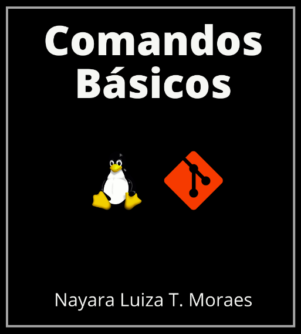
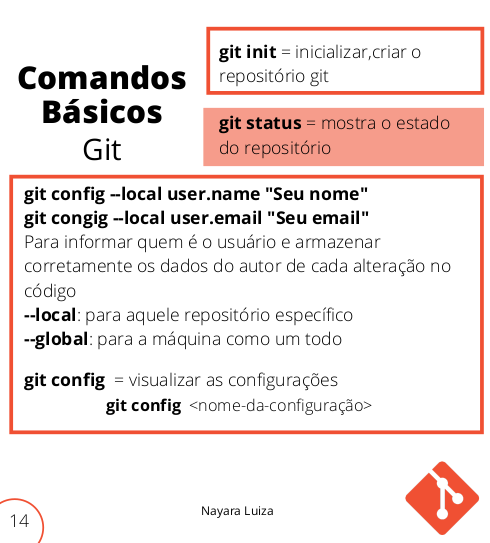

# Simple Notes 

## Descrição do Repositório
O propósito desse repositório é armazenar e compartilhar materiais que eu crio ou que encontro de forma gratuita disponíveis na internet sobre diversos assuntos pertinentes à programação front-end e back-end. 

## Conteúdo 

### Comandos Básicos Linux e Git
É um arquivo que eu criei explicando de forma simples alguns comandos básicos de Linux e Git 

Você pode [baixar o pdf material](https://github.com/nalutm/simple-notes/blob/master/comandos-basicos-linux-git.pdf)

### Folder Flexbox 
É um folder sobre importantes propriedades do flex-box dispostas de forma bastante ilustrativa
Fonte: [CCS TRICKS](https://css-tricks.com/snippets/css/a-guide-to-flexbox/#top-of-site)

Você pode [baixar o folder](https://github.com/nalutm/simple-notes/blob/master/css-flexbox-poster.png) 
